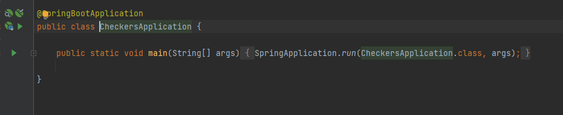
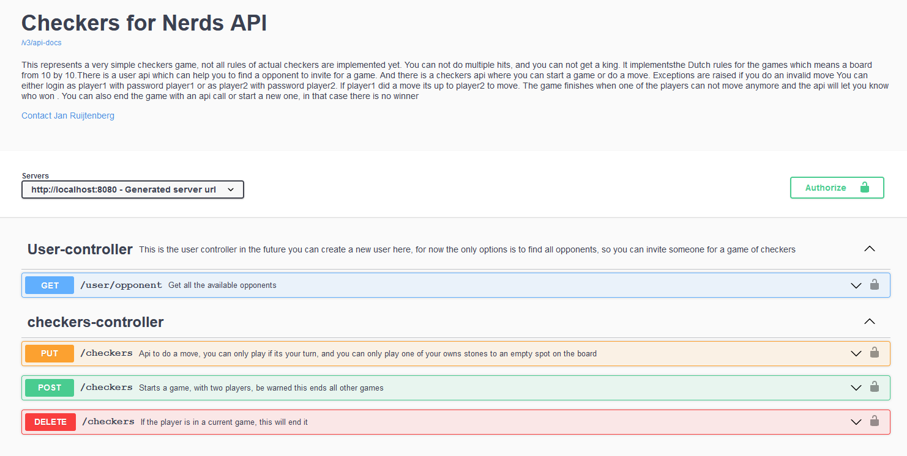

#About 
This represents a very simple checkers game, not all rules of actual checkers are implemented yet. You can not do 
multiple hits, and you can not get a king. I use english as a programming language but implemented the rules of the Dutch 
board game "dammen" this translates to Checkers but is slightly different in the sense that a Dutch board is 10 by 10, 
and the English board is 8 by 8.

It is a real web application with persistent state, so you can play against someone else and your game is automatically 
saved, so you do not lose it if you close the browser.    

# Getting up and running

The project is build with java 8 (I know that is old) and with Maven you need to have both on your machine to build the 
project. I also expect it to work with higher versions of Java, but I have not tried it. You also need git to get the 
code.  

First step is to clone the repository in a folder of your liking  
```console
foo@bar:~$ dev
$ git clone https://github.com/SoloJan/checkers.git
```

You can build and run it from within an Idea. In InteliJ you can go to the file CheckersApplication.java which you
find in the root of the backend project from there you can press the little green arrow and start the program. Or you 
could set up a spring boot run configuration yourself.



Alternatively you can build the project yourself, move to the backend folder (the folder this readme is in) and build it 
with maven using the following command 

```console
foo@bar:~$ dev/backend
$ mvn clean install
```

This will produce a jar in the target folder of the project. You can run the jar. The project is a jar and not a war but
it is actually a web project. This is because springboot comes with a build in Tomcat webserver. You can start the jar 
like any jar but it requires port 8080 to be free. If you have an own instance of Tomcat running it will probably 
interfere it is easy to change the port and there are several ways of doing it and you can also build a war instead. 
Look at the spring documentation to find out. For now go to the target folder and run the following command

```console
foo@bar:~$ dev/backend/target
$ java -jar checkers-for-nerds-1.0-SNAPSHOT.jar
```
# Start playing 

The easiest way to interact with the application is using the swagger documentation. By default, you can find it at 

http://localhost:8080/swagger-ui.html 

You will find all the documentation for the api's but you can also interact with it from the browser. Below is what you 
are expected to find 



# Database setup and management

If you want to get more into the details of the application you probably want to have access to the database this
section describes how to interact with it. 

Spring allows you to have different profiles for different system configurations. It makes it possible to run the 
program with different databases. You can start a  profile either by specifying a parameter in you run configurations or 
when you start it from the commandline, or you can change the default profile in the application.properties which is 
spring.profiles.default=H2. The database connection details are in the profiles, you can modify it if you want to use a 
different jdbc url or a different user. If any of the logins this readme suggests do not work than have a look at 
the property files at the end those are the names and passwords which are  used. 

## H2 database
H2 is an in memory database, its configuration options are set in the application-H2.properties. The thing I like about
the H2 database, is that you dont have to setup anything to make it work. This makes it great for example applications 
and also for testing. The database is created when the program starts and disappears when the program stops, so you can 
play around and start with a clean database everytime. You could also configure it to really store the data, but it is 
not really meant as a production database. You can visit the H2 console on http://localhost:8080/h2-console/ 
login with developer, developer to see the console. Next you need to configure the jdbc url jdbc:h2:mem:checkers and 
user and password flyway you can than see and modify the data in your web browser. 
But you can also use the same credentials to visit the database with any other database viewer. 
By default the application starts with the h2 database, and it is also used in test.

## Postgres database
There is also a postgres profile its configuration options are set in the application-postgres.properties. 
You need to have postgress installed either locally or in docker, or in an external server to make this work. 
You need to make a database with the name checkers and two users one with credentials checkers, checkers and one 
with the credentials flyway, flyway. You might need to configure the properties for your custom situation and you can 
choose different more secure credentials for connecting with the database. I like postgres as a database because it is
easy to set up but also is a real production database. I personally use this profile and not the H2 database

## Flyway
I use flyway to manage the different versions of my database https://flywaydb.org/. 
The folder src/main/resources/db/migration contains all the scripts needed to create the database. Running them one by 
one makes you end up with the database definition as intended by the program. Flyway automatically runs these scripts at 
startup. If the program is already in a particular state for example it already has run the first two scripts than 
flyway will only run the new scripts. Flyway stores which scripts are used in a table called flyway_schema_history. You
should not modify any existing flyway scripts because they might already have run on a database, and you want to 
guarantee consistency across all your environments. If you spot a mistake in a flyway script you need to make a new 
script to restore it. I sometimes do change script in the development phase but never after the code has been merged and
is on different developers or even a test and production environment.